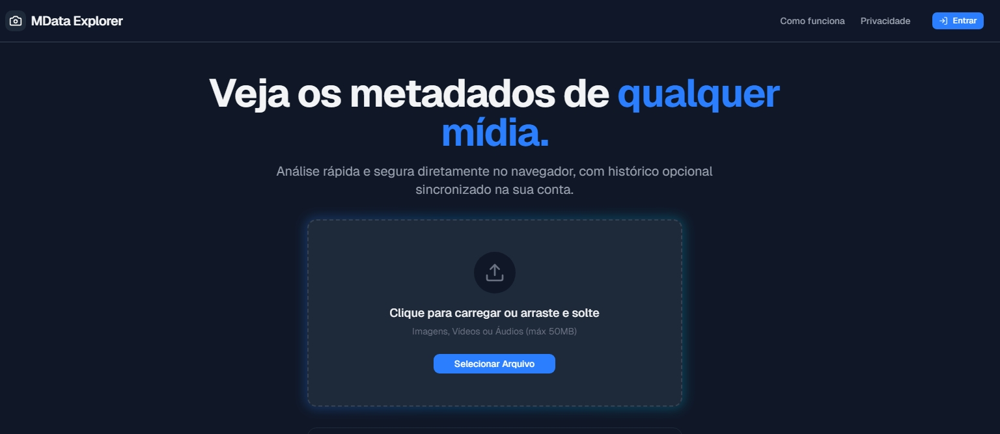
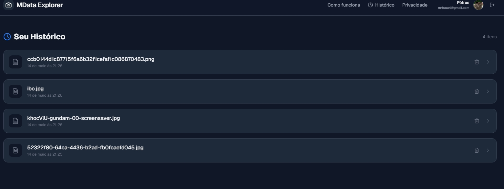
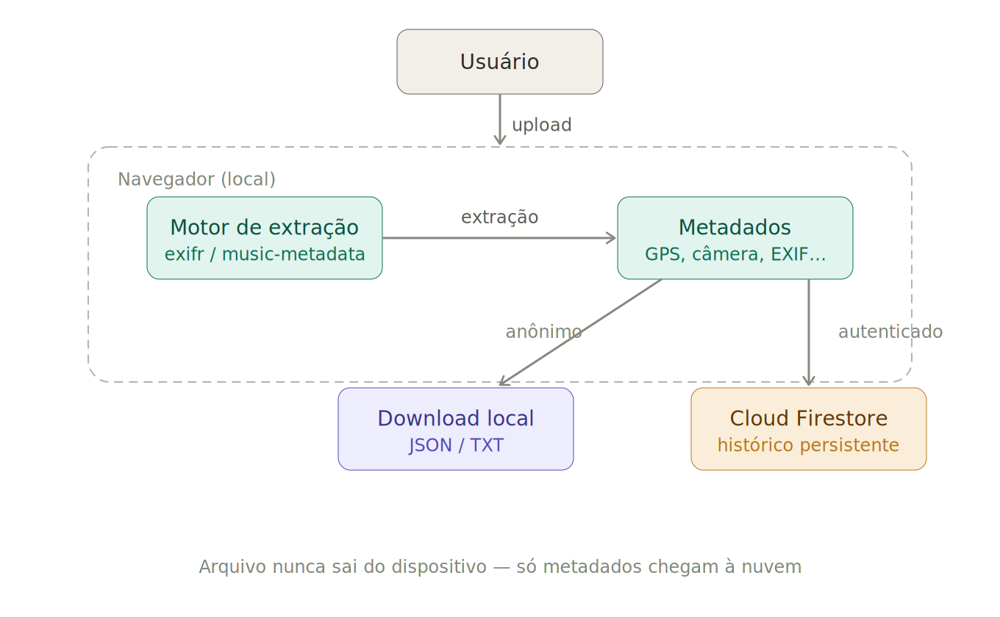

# 🛡️ MData Explorer: Local Metadata Engine & Global Sync

## 📝 Descrição do Projeto
O **MData Explorer** é uma ferramenta de alta performance para extração e análise de metadados de mídia (Imagens, Vídeos e Áudio). Diferente de ferramentas convencionais, o MData prioriza a privacidade absoluta: todo o processamento de extração ocorre **exclusivamente no navegador do usuário**, garantindo que arquivos sensíveis nunca deixem o dispositivo local.

A plataforma oferece uma experiência híbrida única: análise rápida e anônima por padrão, com a opção de sincronização em nuvem via **Google Firebase** para usuários que desejam manter um histórico persistente e organizado de suas análises em múltiplos dispositivos.

---

*Figura 1: Interface principal destacando a área de upload local.*

## 🚀 Tecnologias Utilizadas
* **Frontend:** React 18 + TypeScript + Vite
* **Estilização:** Tailwind CSS (Arquitetura de Design Moderna & Dark Mode)
* **Backend & Auth:** Firebase (Google Authentication & Cloud Firestore)
* **Motores de Extração:** Exifr (EXIF/XMP/IPTC) & music-metadata-browser (Audio/Video tags)
* **Data Management:** Context API para estado global e sincronização de cache
* **Animações:** Lucide React (Ícones dinâmicos) + Tailwind Transitions

## 📊 Resultados e Funcionalidades
O projeto foi estruturado para ser uma ferramenta indispensável para entusiastas de privacidade e profissionais de mídia:
* **Privacidade Local (Zero-Server):** Extração de dados sensíveis (GPS, Settings, Camera Info) sem upload de arquivos.
* **Sincronização de Histórico:** Armazenamento seguro no Firestore para usuários autenticados, permitindo revisitar análises anteriores.
* **Remoção de Metadados:** Funcionalidade integrada para "limpar" imagens antes de baixar, removendo tags GPS e de identificação.
* **Filtragem Inteligente:** Busca em tempo real e categorização automática (Info do Arquivo, Câmera, GPS, IPTC, XMP).
* **Exportação Multiformat:** Download de resultados em JSON ou TXT para integração com outros fluxos de trabalho.

*Figura 2: Visualização de histórico persistente.*

## 🔧 Como Executar
1. Clone o repositório.
2. Certifique-se de ter o Node.js instalado.
3. Configure o arquivo `firebase-applet-config.json` com suas credenciais do projeto Firebase.
4. Instale as dependências: `npm install`.
5. Execute o servidor de desenvolvimento: `npm run dev`.

*Figura 3: Fluxo de dados demonstrando o processamento local vs. sincronização de metadados no Firestore.*

---
[Voltar ao início](#🛡️-mdata-explorer-local-metadata-engine--global-sync)
