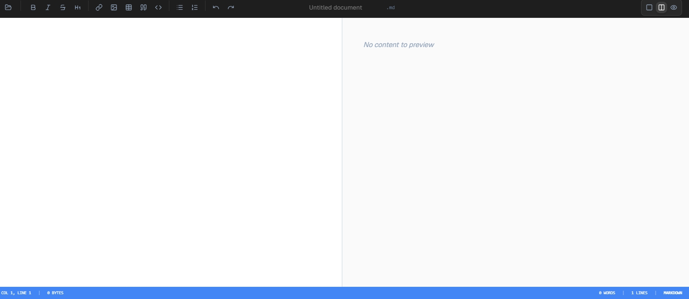
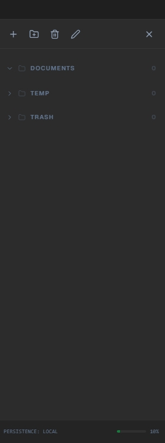

# 📝 StackEdit Clone: Real-Time Markdown Editor

## 📝 Descrição do Projeto

O **StackEdit Clone** é uma reconstrução fiel do editor Markdown online [StackEdit](https://stackedit.io), desenvolvida através de engenharia reversa assistida por IA generativa. O projeto reproduz a experiência de edição em tempo real com visualização sincronizada, sem acesso ao código-fonte original — apenas com base na análise da interface, comportamento e lógica de negócio observados na aplicação de referência.

A reconstrução prioriza fidelidade estética e funcional: layout dividido entre editor e preview, toolbar de formatação, sidebar de gerenciamento de arquivos e barra de status em tempo real, replicando a experiência do produto original com stack moderna e código limpo.

---

*Figura 1: Interface principal com editor à esquerda, preview renderizado à direita e toolbar de formatação.*

## 🚀 Tecnologias Utilizadas

* **Frontend:** React 18 + TypeScript + Vite
* **Estilização:** Tailwind CSS + Shadcn/ui
* **Syntax Highlighting:** Prism.js (overlay sobre textarea transparente)
* **Renderização Markdown:** react-markdown
* **Animações:** Framer Motion (transições de layout e sidebar)
* **Persistência:** Context API + LocalStorage (FileContext e EditorUIContext)
* **Ícones:** Lucide React

## 📊 Análise Crítica: Desenvolvimento Assistido por IA

### Questão A — A Formação do Desenvolvedor na Era da IA

O esforço deixa de ser sintático e passa a ser lógico e descritivo. Quem apenas escreve código compete diretamente com a IA e perde; quem pensa sobre sistemas usa a ferramenta como alavanca.

**Capacidade de especificação:** é preciso separar um sistema em partes observáveis, nomear comportamentos com precisão e identificar as regras de negócio por trás da interface. Isso envolve leitura crítica de sistemas, escrita técnica clara e raciocínio sobre estados e transições.

**Senso crítico para validação e refinamento:** a IA gera uma primeira aproximação. Cabe ao engenheiro identificar onde divergiu, por que divergiu e como ajustar o prompt ou o código para convergir ao resultado esperado.

### Questão B — Originalidade vs. Plágio Digital

A engenharia reversa assistida por IA se torna plágio quando há reprodução de elementos protegidos (como UI proprietário ou fluxos UX registrados), ausência de transformações significativas e dano econômico direto ao produto original. Quando essas três condições ocorrem simultaneamente, a prática deixa de ser aprendizado.

Uma proposta para evitar isso é documentar o que foi observado, o que foi alterado e qual problema novo o produto resolve que o original não resolvia. Esse registro cria um rastro de boa-fé e incentiva a inovação incremental sem frear o uso das ferramentas generativas.

*Figura 2: Sidebar com estrutura de arquivos e ícones de ação, fiel ao layout original do StackEdit.*

## 🔧 Como Executar

1. Clone o repositório.
2. Instale as dependências: `npm install`.
3. Execute o servidor de desenvolvimento: `npm run dev`.
4. Acesse `http://localhost:5173` no navegador.

---

[Voltar ao início](https://github.com/Average-0/portfolio-petrus-pereira-de-lima)
